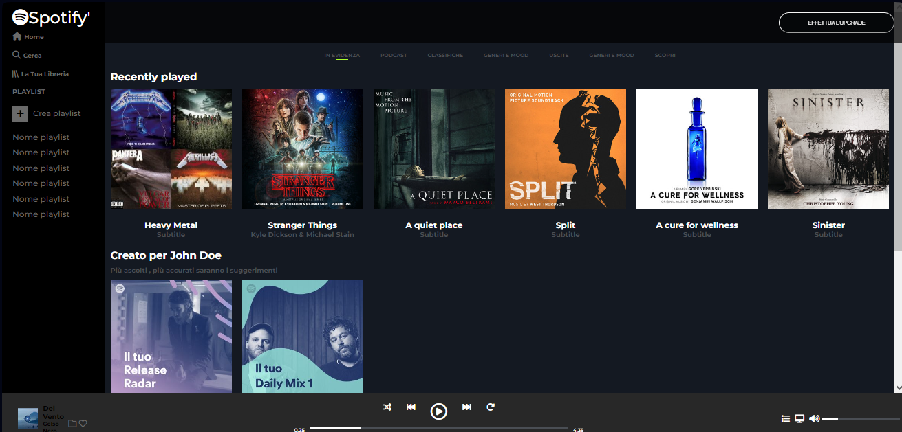

 

##Boolflix

- DESCRIZIONE :
    -Questo esercizio si svolgerà in più giorni quindi come sempre pensate prima a far funzionare le macroaree, se quelle funzionano allora passate al dettaglio.
    -Potete utilizzare le regole che abbiamo visto fin ad ora. Ok, ma come fate a scegliere la soluzione giusta? A volte vi sembrerà subito evidente, altre volte potreste complicarvi la vita. Se vedete che una strada non vi sta portando nel          posto giusto... potete cambiarla!
-Breakpoint
    - Mobile piccolo: fino a 600px
    - Mobile normale: fino a 700px
    - Tablet: fino a 1100px
    - Desktop: fino all'infinito
    - Buon Lavoro! (modificato) 
